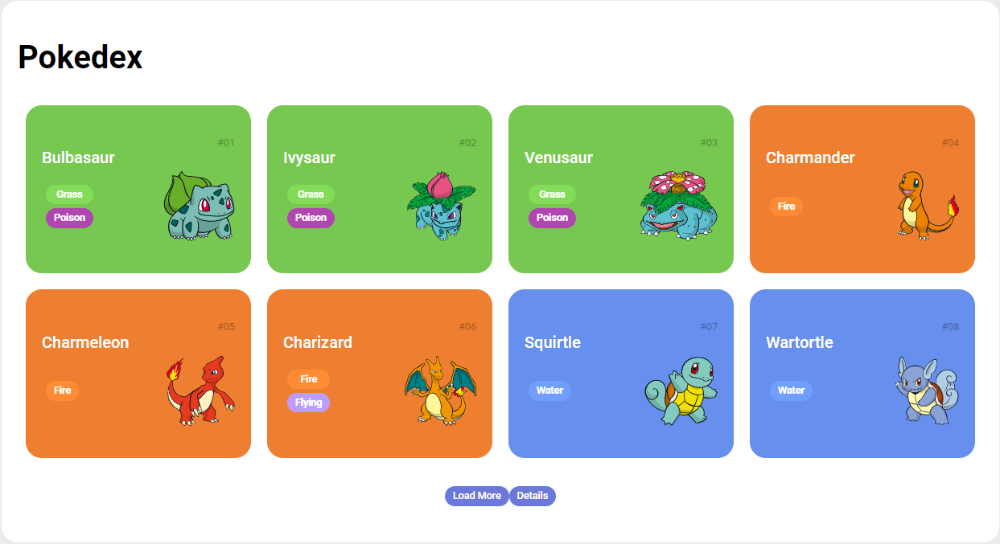
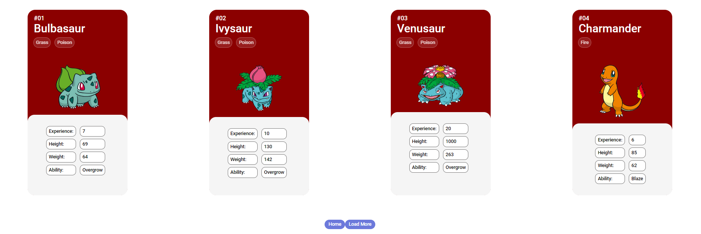

<h1 align="center"> Pokedex</h1>

## 👨🏾‍💻: Sobre o projeto

Esta pokedex possui duas telas. 
Na primeira tela, podemos ver os pokemons, com as seguintes informações: 
 - Nome 
 - Tipo 
 - Imagem
 - Número 
 
 A quantidade de pokemons foi limitada em 151, constando apenas os pokemons de 1ª geração. Para carregar mais pokemons, basta clicar no botão **"Load more"**. 
 
É possivel chegar a segunda tela clicando no botão **"Details"**.

Nessa tela, podemos ver os cards dos pokemons com mais detalhes, como: 
 - Experiência
 - Altura
 - Peso
 - Habilidade

Para a obter as informações sobre os Pokémons foi utilizada a API do [PokéAPI](https://pokeapi.co/api/v2/pokemon).

## 💻 Tecnologias usadas:

## 📄 Página 1
 
 
 ## :tv: Tela 2
 

 **Baseado no projeto de CarolFOliveira**
 
 